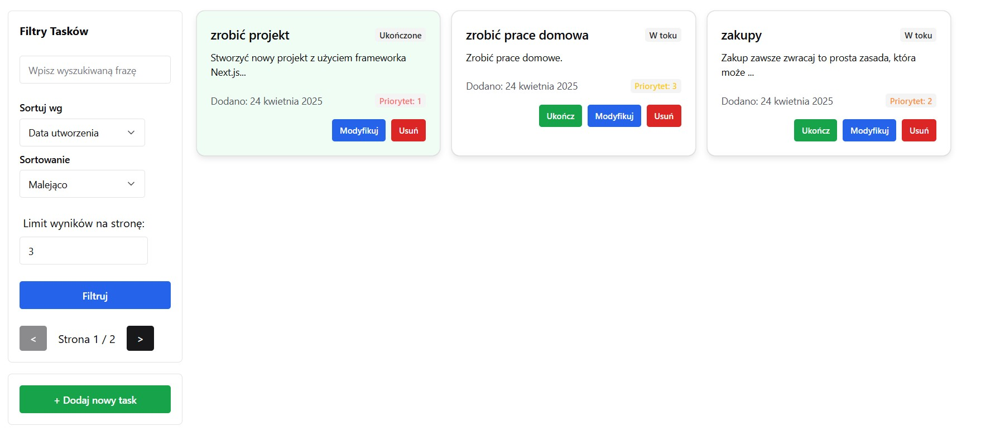
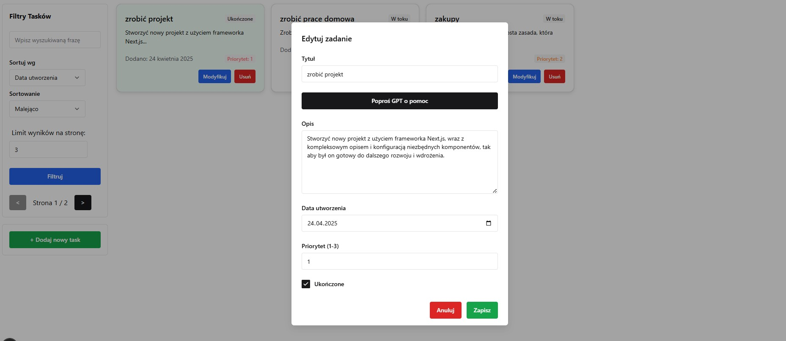
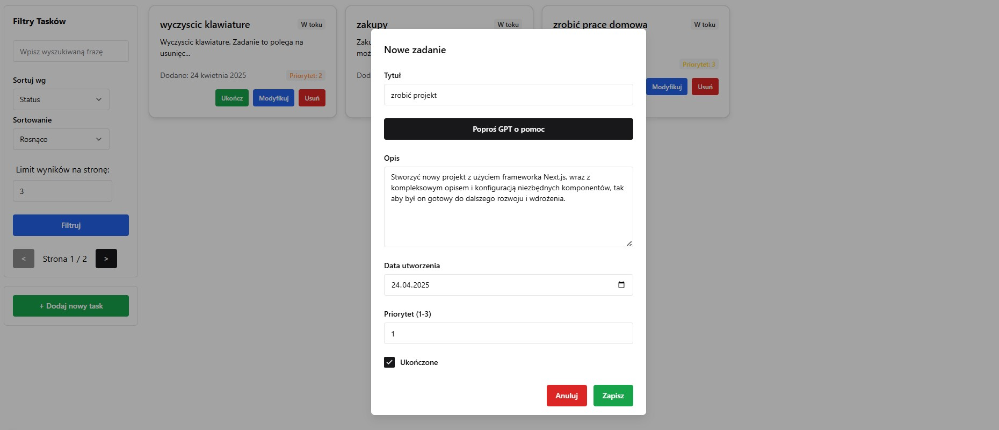
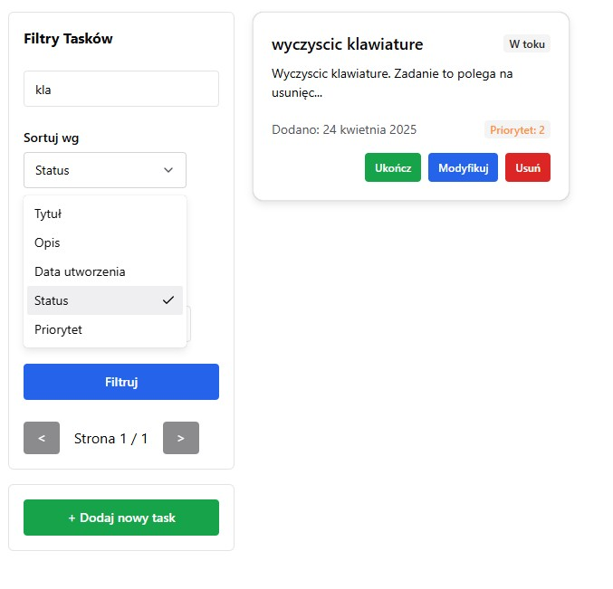

# Next.js MongoDB Application

This is a simple application built with Next.js and MongoDB for managing a collection of entities. The application allows users to perform CRUD operations (Create, Read, Update, Delete) on entities, which are stored in a MongoDB database using Mongoose as the ORM.

## Features

- **Entity Management**: Add, edit, delete, and list entities.
- **Dynamic Data Fetching**: Fetch and store external data from GPT/Groq (LLM response).
- **Sorting and Searching**: Easily sort and search through the list of entities.
- **Pagination**: Navigate through large sets of entities with pagination support.
- **Unique Identifier**: Each entity has a unique identifier for easy access and management.

## Technologies Used

- **Next.js**: A React framework for building server-side rendered applications.
- **MongoDB**: A NoSQL database for storing entity data.
- **Mongoose**: An ODM (Object Data Modeling) library for MongoDB and Node.js.
- **TypeScript**: A superset of JavaScript that adds static types.
- **Chakra UI**: A simple, modular, and accessible component library for React applications.

## Some Screenshots






## Getting Started

### Prerequisites

- Node.js (version 14 or higher)
- MongoDB (local or cloud instance)

### Installation

1. Clone the repository:

   ```bash
   git clone https://github.com/barszu/TaskManagingApp.git
   ```

2. Navigate to the project directory:

   ```bash
   cd TaskManagingApp
   ```

3. Install the dependencies:

   ```bash
   npm install
   ```

4. Set up your environment variables in the `.env.local` file (root of project).

   ```
   MONGODB_URI=<your_mongodb_uri>
   MONGODB_DB=<your_database_name>
   GROQ_API_KEY=<your_groq_api_key>
   ```

### Running the Application

To start the development server, run:

```bash
npm run dev
```

Building, starting (non dev mode):

```bash
npm run build
npm start
```

The application will be available at `http://localhost:3000`.

### API Endpoints

For detailed API documentation, refer to the [API Documentation](docs/README.md) available in the `docs` folder.

### Testing

To run the tests, use the following command:

```bash
npm test
```

## License

This project is open-source and available under the MIT License.
